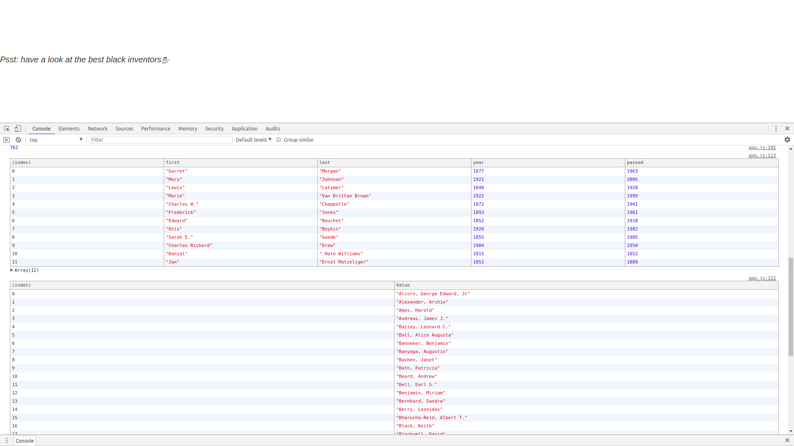
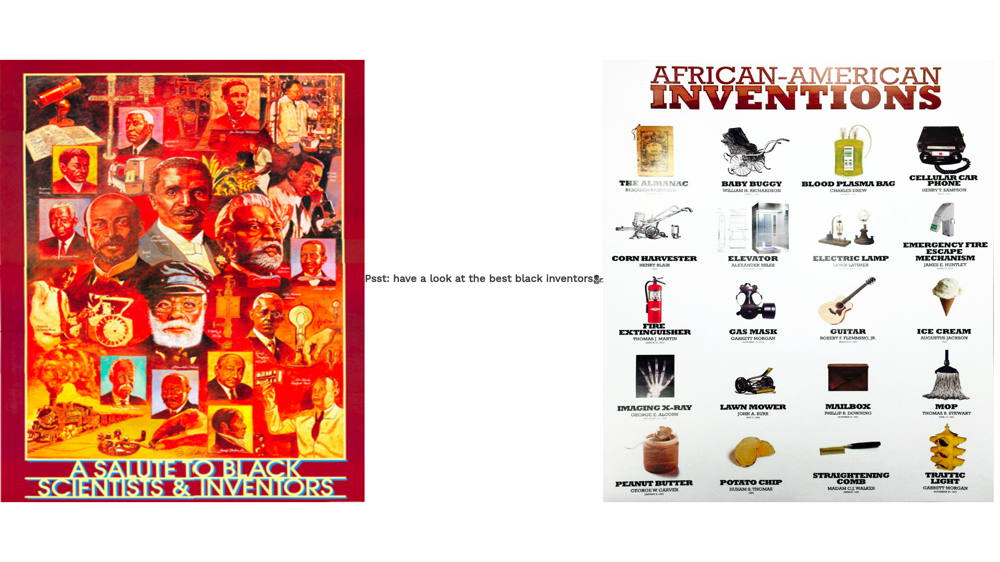

# My Awesome Project
Happy Sunday Github,

This afternoon I spent some time doing a tutorial on practicing Array's! One I went thru the Wes Bos tutorial I wanted to practice the new methods I had learned but I created my own array of inventors, which were all the famous and not so famous inventors! As well as famous Haitian people in History! I know black history month has been over now but February isn't the only month we can admirate people that did some much great things for not only the culture but for the world!

## How It's Made
This was an easy set up on the HTML, I only wrote a 
 and went straight to JavaScript where I had to list all the people and their properties which was first, last, year and passed. Which represent the first name, last name, year born and year passed away for the person.

## Lessons Learned:

I used methods like .filter(), .map(), .sort(), .reduce(), as well as ES6 ARROW FUNCTIONS!

## portfolio:

**WEBSITE:** https:johnfleurimond.com

## Happy Coding!!!!
